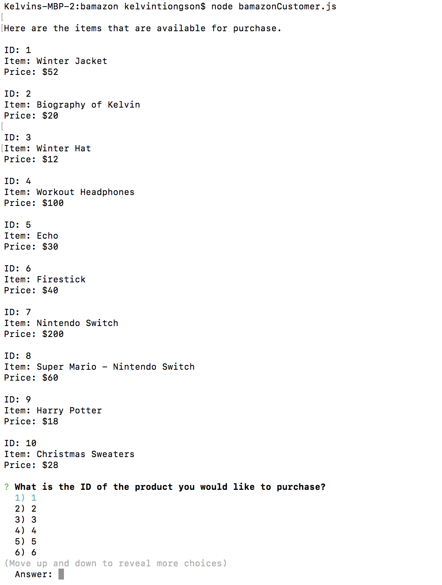

# bamazon

## First Screen Shot

+ This screen shot shows the beginnning of the app. It shows the list of the items with their ID, name, and price.

## Second Screen Shot

+ This screen shot shows the use of the app. Item 4 (Workout Headphones) was selected. I showed that the user must decide on a sufficient quantity of the item. Finally, the user picks a sufficient quantity and a total was calculated.

## Third Screen Shot

+ This screen shot shows table before the update was made after the user's purchase.

## Fourth Screen Shot

+ This screen shot shows the updated table after the user made the purchase. You can see that the quantity of the Workout Headphones has changed from 8 to 3 since the user had bought 5 of them earlier.
